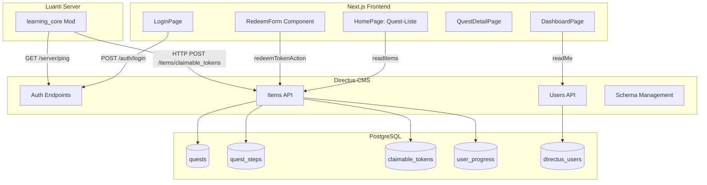
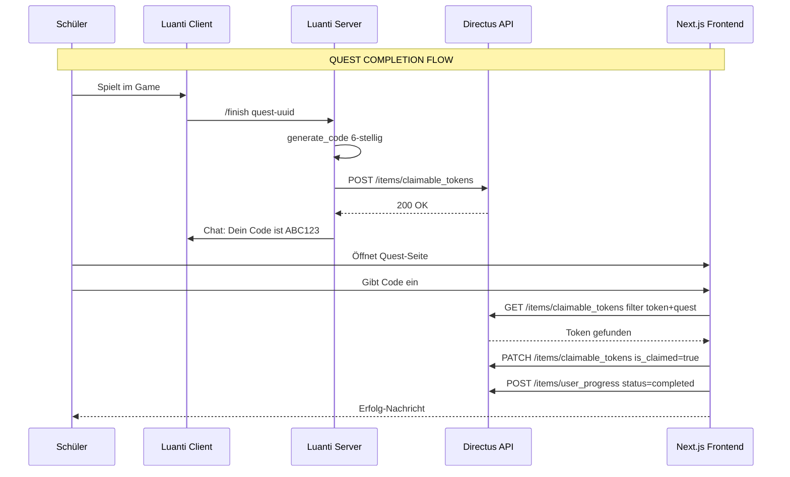

# 🏗 Luanti-LMS: Projekt-Status & Architektur-Audit

> **Letzte Analyse:** 2026-02-05
> **Analyst:** AI-Architektur-Audit
> **Projekt-Phase:** Phase 3 - XP-Logik & Level-System
> **Aktueller Fokus:** Implementierung der XP-Logik und Level-System

---

## 1. High-Level Übersicht

### Tech Stack

| Kategorie | Technologie | Version |
|-----------|-------------|---------|
| **Backend/CMS** | Directus | 11.14.1 |
| **Database** | PostgreSQL + PostGIS | 15-3.3 |
| **Cache/Queue** | Redis | 7-alpine |
| **Frontend** | Next.js | 16.1.5 |
| **UI Framework** | React | 19.2.3 |
| **Styling** | TailwindCSS | 4.x |
| **Type System** | TypeScript | 5.x |
| **Game Server** | Luanti (Minetest Fork) | latest |
| **Reverse Proxy** | Traefik | v3.0 |
| **Containerization** | Docker Compose | v2 |
| **SDK** | @directus/sdk | 21.0.0 |

### Kern-Funktionalität (Aktueller Status)

Das Backend kann aktuell **wirklich**:

| Feature | Status | Beschreibung |
|---------|--------|--------------|
| ✅ **Quest-Management** | Funktional | Erstellen, Bearbeiten, Veröffentlichen von Quests via Directus Admin |
| ✅ **Quest-Steps** | Funktional | Mehrstufige Quests mit Sortierung und Step-Types |
| ✅ **User Authentication** | Funktional | Login via Directus Auth, JWT-basierte Sessions |
| ✅ **Token-Flow Luanti → Frontend** | Funktional | Mod generiert Code, sendet an API, User löst ein |
| ✅ **User Progress Tracking** | Basis | Speichern abgeschlossener Quests |
| ⚠️ **XP/Coins System** | Nur UI | Felder existieren, aber keine Berechnungslogik |
| ❌ **Schools/Multi-Tenancy** | Nur TypeScript | DB-Tabellen fehlen komplett |
| ❌ **Luanti Worlds Management** | Nur TypeScript | DB-Tabellen fehlen komplett |
| ❌ **Level-System** | Nicht implementiert | `min_level_required` existiert nur im Type |

---

## 2. Architektur-Landkarte (Status Quo)

### Existierende Module



### Datenbank-Integrität

#### Collections (Tabellen)

| Collection | Status | Felder | Foreign Keys |
|------------|--------|--------|--------------|
| `quests` | ✅ Vollständig | id, status, sort, date_created, date_updated, title, description, subject, difficulty | - |
| `quest_steps` | ✅ Vollständig | id, status, sort, title, content, step_type, quest_id, validation_rule | quest_id → quests |
| `claimable_tokens` | ✅ Vollständig | id, token, quest_id, is_claimed, claimed_by | quest_id → quests, claimed_by → directus_users |
| `user_progress` | ✅ Vollständig | id, date_created, date_updated, user_id, quest_step_id, status, token_fragment | user_id → directus_users, quest_step_id → quest_steps |
| `user_progress_directus_users` | ✅ Junction | id, user_progress_id, directus_users_id | M2M Junction Table |
| `user_progress_quest_steps` | ✅ Junction | id, user_progress_id, quest_steps_id | M2M Junction Table |

#### Kritische Schema-Probleme

| Problem | Schweregrad | Beschreibung |
|---------|-------------|--------------|
| 🔴 **Fehlende Indizes** | Hoch | `token` in `claimable_tokens` hat `is_indexed: false` - bei Skalierung Performanz-Problem |
| 🔴 **Fehlende Unique-Constraints** | Hoch | `token` sollte unique sein, ist es aber nicht |
| 🟡 **JSON statt Enum** | Mittel | `status` in `user_progress` ist JSON Array statt Enum/String |
| 🟡 **ON DELETE: SET NULL** | Mittel | Alle FKs setzen auf NULL statt CASCADE - verwaiste Daten möglich |
| 🔴 **Fehlende Tabellen** | Kritisch | `schools`, `luanti_worlds` existieren NUR im TypeScript, NICHT in DB |

### API-Endpunkte (implementiert)

#### Directus Core API (automatisch)

| Endpunkt | Methode | Beschreibung | Auth Required |
|----------|---------|--------------|---------------|
| `/auth/login` | POST | User Login | ❌ |
| `/auth/logout` | POST | User Logout | ✅ |
| `/auth/refresh` | POST | Token Refresh | ✅ (Refresh Token) |
| `/users/me` | GET | Aktueller User | ✅ |
| `/server/ping` | GET | Health Check | ❌ |

#### Items API (pro Collection)

| Collection | GET (List) | GET (Item) | POST | PATCH | DELETE |
|------------|------------|------------|------|-------|--------|
| `/items/quests` | ✅ | ✅ | ✅ | ✅ | ✅ |
| `/items/quest_steps` | ✅ | ✅ | ✅ | ✅ | ✅ |
| `/items/claimable_tokens` | ✅ | ✅ | ✅ | ✅ | ✅ |
| `/items/user_progress` | ✅ | ✅ | ✅ | ✅ | ✅ |

---

## 3. Gap-Analysis (Lücken-Erkennung)

### Fehlende Kern-Logik

| Lücke | Datei | Beschreibung |
|-------|-------|--------------|
| 🔴 **Keine XP-Berechnung** | [`frontend/src/app/actions.ts:137`](frontend/src/app/actions.ts:137) | `createItem('user_progress', {...})` speichert nur Status, KEINE XP-Gutschrift |
| 🔴 **Hardcoded Quest-ID Handling** | [`luanti/mods/learning_core/init.lua:87`](luanti/mods/learning_core/init.lua:87) | Quest-ID muss manuell als Parameter übergeben werden |
| 🔴 **Fehlender Level-Check** | TypeScript Schema | `min_level_required` in Quest-Type definiert, aber nirgends geprüft |
| 🟡 **Kein Step-Progress** | Frontend | Nur Quest-Completion, nicht einzelne Steps |
| 🟡 **Keine Validation** | Backend | `validation_rule` Feld in quest_steps existiert, aber keine Logik |
| 🔴 **Schools fehlen komplett** | TypeScript vs DB | Multi-Tenancy nur geplant |

### Sicherheit

| Risiko | Schweregrad | Datei/Ort | Beschreibung |
|--------|-------------|-----------|--------------|
| 🔴 **Hardcoded API Token** | KRITISCH | [`luanti/mods/learning_core/init.lua:20`](luanti/mods/learning_core/init.lua:20) | `auth_token = "M2zWlW5F2FkvAQa60H4xRfJUYhkoBqdp"` im Code |
| 🟡 **Keine Input-Validierung** | Mittel | Frontend | Token-Input nur `required`, keine Regex-Prüfung |
| 🟡 **CORS: Wildcard** | Mittel | [`docker-compose.yml:148`](docker-compose.yml:148) | `CORS_ORIGIN: "true"` - sollte spezifische Domains sein |
| ✅ **Rate Limiting** | OK | Docker Compose | Aktiviert via Redis (50 req/s) |
| ✅ **JWT Security** | OK | Docker Compose | Kurze TTL, Secure Cookies |
| 🟡 **Dashboard Auth-Check** | Mittel | [`frontend/src/app/dashboard/page.tsx:63`](frontend/src/app/dashboard/page.tsx:63) | Nur try/catch, kein expliziter Token-Validierungs-Flow |

### Testing

| Kategorie | Status | Beschreibung |
|-----------|--------|--------------|
| Unit Tests | ❌ **0%** | Keine Tests vorhanden |
| Integration Tests | ❌ **0%** | Keine Tests vorhanden |
| E2E Tests | ❌ **0%** | Keine Tests vorhanden |
| Type Coverage | ⚠️ **Partiell** | TypeScript aktiv, aber viele `any` casts |

> **Kritisch:** Es gibt KEINE Test-Dateien im gesamten Projekt. Kein `__tests__`, kein `*.test.ts`, keine Jest/Vitest Config.

---

## 4. Integrations-Matrix (Anbindungen)

| System | Status | Art der Anbindung | Todo / Missing |
|:-------|:------:|:------------------|:---------------|
| **Frontend** | 🟢 Funktional | REST API via @directus/sdk | [x] Docker Service added, ✅ TypeScript Types synchronisiert |
| **Luanti Engine** | 🟢 Funktional | HTTP REST (Mod → Directus) | ✅ Token aus `minetest.conf` |
| **Directus CMS** | 🟢 Funktional | PostgreSQL + Redis | ✅ Schema-Export via bootstrap.sh, Migrations dokumentiert |
| **PostgreSQL** | 🟢 Verifiziert | Directus ORM | ✅ Schema Audit Passed - `xp_total`, `coins_balance` etc. existieren |
| **Redis** | 🟢 Funktional | Cache + Rate Limiting | Optimal konfiguriert |
| **Traefik** | 🟢 Funktional | Reverse Proxy (HTTP) | UDP für Luanti separat |
| **CodeCombat** | 🔴 Offen | Geplant | Datenstrukturen, API-Anbindung, Progress-Sync fehlen komplett |
| **E-Mail** | 🔴 Offen | SMTP (geplant) | Auskommentiert in docker-compose.yml |

### Kommunikations-Flow (Aktuell)



---

## 5. Vorbereitung für CodeCombat & Content

### Fehlende Tabellen/Felder für CodeCombat

| Tabelle/Feld | Zweck | Vorgeschlagener Typ |
|--------------|-------|---------------------|
| `codecombat_levels` | Level-Mapping CodeCombat ↔ Quest | Collection mit `level_id`, `quest_step_id`, `language` |
| `codecombat_progress` | CC-Fortschritt pro User | `user_id`, `level_id`, `completed_at`, `code_solution` |
| `quest_steps.external_id` | Verknüpfung zu CC Level | String, nullable |
| `quest_steps.external_system` | Enum: codecombat, scratch, etc. | Enum/Dropdown |
| `users.codecombat_id` | CC-Account Verknüpfung | Erweiterung von directus_users |

### Content-Delivery (Aktueller Zustand)

| Aspekt | Status | Beschreibung |
|--------|--------|--------------|
| **Quest Content** | Directus | Markdown via Rich-Text Editor |
| **Media/Assets** | Directus | File Storage lokal (`/directus/uploads`) |
| **CDN** | ❌ Nicht vorhanden | Für Skalierung: Cloudflare/S3 nötig |
| **Caching** | ✅ Redis | 30min TTL, gut konfiguriert |
| **Lokalisierung** | ❌ Nicht implementiert | Keine i18n-Struktur |

### Skalierungs-Anforderungen

1. **Asset-CDN**: Für Video/Bilder-Heavy Content → S3/Cloudflare Integration
2. **Multi-Language**: Directus Translations aktivieren für Quests
3. **Versioning**: Quest-Versionierung für A/B-Testing
4. **Analytics**: Event-Tracking für Content-Performance

---

## 6. Action Plan (Priorisiert)

### ✅ 1. Critical Fixes (ERLEDIGT)

| # | Task | Datei | Beschreibung | Status |
|---|------|-------|--------------|--------|
| 1.1 | ~~**API Token aus Code entfernen**~~ | [`luanti/mods/learning_core/init.lua`](luanti/mods/learning_core/init.lua) | Token wird jetzt aus `minetest.conf` via `minetest.settings:get("llu_api_token")` gelesen | ✅ Erledigt (2026-02-05) |
| 1.2 | ~~**Token-Feld unique + indexed machen**~~ | [`docs/migrations/001_claimable_tokens_unique_index.md`](../docs/migrations/001_claimable_tokens_unique_index.md) | Migrations-Anleitung erstellt (Directus Admin + SQL) | ✅ Dokumentiert (2026-02-05) |
| 1.3 | ~~**CORS konfigurieren**~~ | [`docker-compose.yml`](docker-compose.yml) | `CORS_ORIGIN: "http://localhost:3000"` statt `"true"` | ✅ Erledigt (2026-02-05) |
| 1.4 | ~~**TypeScript Types synchronisieren**~~ | [`docs/migrations/002_schools_luanti_worlds.md`](../docs/migrations/002_schools_luanti_worlds.md) | Migrations-Anleitung + API-Skript erstellt für `schools`, `luanti_worlds` + User-Erweiterungen | ✅ Dokumentiert (2026-02-05) |
| 1.5 | ~~**Any-Casts eliminieren**~~ | [`frontend/src/app/actions.ts`](frontend/src/app/actions.ts) | Typisierte `DirectusSchema`, `ClaimableTokenFilter`, `DirectusError` Interfaces | ✅ Erledigt (2026-02-05) |
| 1.6 | ~~**Schema Audit durchführen**~~ | [`scripts/audit-schema.ts`](../scripts/audit-schema.ts) | Alle DB-Felder verifiziert: `xp_total`, `coins_balance` etc. existieren | ✅ Erledigt (2026-02-05) |

### 🟡 2. Preparation (CodeCombat Integration)

| # | Task | Beschreibung |
|---|------|--------------|
| 2.1 | **DB-Schema erweitern** | Neue Collections: `codecombat_levels`, `codecombat_progress` |
| 2.2 | **OAuth/API Key Handling** | System für externe Service-Credentials |
| 2.3 | **Webhook Endpoint** | Directus Extension für CC Progress-Updates |
| 2.4 | **Quest-Step Types erweitern** | `step_type` um `codecombat` erweitern |
| 2.5 | **Frontend CC-Embed** | iFrame oder API-Integration für CC Levels |

### 🟢 3. Next Features (Content-System) - **PHASE 3 AKTIV**

| # | Task | Beschreibung | Status |
|---|------|--------------|--------|
| 3.1 | **XP-System implementieren** | Hook bei Token-Redemption → XP basierend auf Quest-Difficulty | 🔄 In Arbeit |
| 3.2 | **Level-System** | User-Level aus XP berechnen, `min_level_required` prüfen | ⏳ Geplant |
| 3.3 | **Schools/Multi-Tenancy** | DB-Tabellen erstellen, Directus Permissions anpassen |
| 3.4 | **Test-Suite aufbauen** | Vitest für Frontend, API-Tests für kritische Flows |
| 3.5 | **Dashboard erweitern** | Aktive Quests, Progress-Bars, Achievements |
| 3.6 | **Admin-Dashboard** | Lehrer-View für Klassenfortschritt |

---

## Anhang: Schema-Diff (TypeScript vs. Database)

```diff
// frontend/src/types/schema.d.ts vs. backend/schema/snapshot.yaml

+ School              // NUR in TypeScript, NICHT in DB
+ LuantiWorld         // NUR in TypeScript, NICHT in DB

Quest:
-  subject: QuestSubject (Enum)
+  subject: JSON Array (DB)

-  min_level_required: number  // NUR in TypeScript
-  date_created: ISODateString // Optional in Type, auto in DB

QuestStep:
-  content_data: Record<string,any>  // TypeScript
+  content: text                      // DB (nur Markdown)

-  completion_token_secret: string   // NUR in TypeScript

User:
-  role: UserRole (Enum)             // Custom Enum
+  // Uses directus_users (system table)
-  school_id                          // NUR in TypeScript
-  luanti_player_name                 // NUR in TypeScript
-  xp_total                           // NUR in TypeScript (oder custom field?)
-  coins_balance                      // NUR in TypeScript (oder custom field?)

UserProgress:
-  status: 'started' | 'completed' | 'failed'  // TypeScript
+  status: JSON Array                           // DB (inkonsistent)
```

---

## Fazit

Das Projekt hat eine **solide Grundlage** mit einem funktionierenden MVP-Flow (Quest → Luanti → Token → Redemption).

### ✅ Behobene Probleme (2026-02-05)

1. ~~**Sicherheit**: Hardcoded Token~~ → Token wird jetzt aus `minetest.conf` gelesen
2. ~~**CORS Wildcard**~~ → Spezifische Domain konfiguriert (`http://localhost:3000`)
3. ~~**Token UNIQUE/INDEX**~~ → Migrations-Anleitung erstellt ([`001_claimable_tokens_unique_index.md`](../docs/migrations/001_claimable_tokens_unique_index.md))
4. ~~**Schema-Inkonsistenz**~~ → Migrations-Anleitung + Skript erstellt ([`002_schools_luanti_worlds.md`](../docs/migrations/002_schools_luanti_worlds.md), [`scripts/migrate-schema.ts`](../scripts/migrate-schema.ts))
5. ~~**Any-Casts in actions.ts**~~ → Typisierte Directus SDK Aufrufe implementiert

### ⏳ Verbleibende kritische Lücken:

1. **DB-Migration ausführen**: [`docs/migrations/002_schools_luanti_worlds.md`](../docs/migrations/002_schools_luanti_worlds.md) im Directus Admin Panel anwenden
2. **Fehlende Features**: XP/Level-System nur UI, keine Logik
3. **Testing**: 0% Coverage - hohes Risiko bei Änderungen
4. **Multi-Tenancy**: Schools-Konzept dokumentiert, aber noch nicht implementiert

### 📋 Nächste Schritte

1. Migration 002 im Directus Admin Panel durchführen (oder Skript ausführen: `DIRECTUS_ADMIN_TOKEN=xxx npx tsx scripts/migrate-schema.ts`)
2. Backend Schema exportieren: `./backend/bootstrap.sh`
3. TypeScript Build prüfen: `cd frontend && npm run build`

Für "Vibe Coding" ist das Projekt **nach Ausführung der DB-Migration** vollständig vorbereitet. Alle Critical Fixes sind dokumentiert und teilweise implementiert. Die Directus-basierte Architektur ermöglicht schnelles Prototyping neuer Features.
